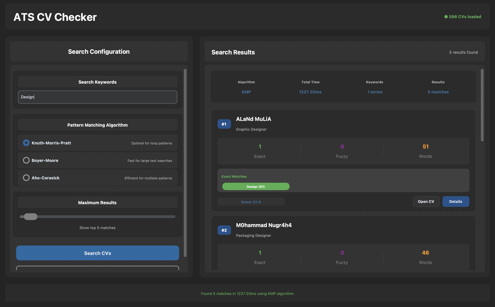

<h1 align="center">Tugas Besar 3 IF2211 Strategi Algoritma</h1>
<h2 align="center">Semester II tahun 2024/2025</h2>
<h2 align="center">Pemanfaatan Pattern Matching untuk Membangun Sistem ATS (Applicant Tracking System) Berbasis CV Digital
</h2>

<p align="center">
  
</p>

## Table of Contents

- [Description](#description)
- [Requirements & Installation](#requirements--installation)
- [How to Run](#how-to-run)
- [Author](#author)

## Description
This project is developed as part of Tugas Besar 3 IF2211 - Strategi Algoritma at Institut Teknologi Bandung. It focuses on building an Applicant Tracking System (ATS) capable of automatically analyzing and matching digital CVs to recruiter-specified keywords using advanced string matching algorithms. The system is designed to improve the efficiency and accuracy of the recruitment process by extracting and evaluating relevant information from unstructured CV documents in PDF format.

To achieve this, the application implements multiple pattern matching algorithms. Knuth-Morris-Pratt (KMP) and Boyer-Moore (BM) are used for efficient single-pattern exact matching. Additionally, as a bonus feature, the Aho–Corasick algorithm is integrated to handle simultaneous multi-pattern searches in linear time, allowing the system to scan for many keywords in a single pass. In cases where exact matches are not found, the system falls back on Levenshtein Distance to provide fuzzy matching capabilities, enabling it to tolerate typos and variations in input.

Text extraction is performed using a PDF parser, and additional information such as skills, education, and work experience is retrieved using regular expressions. The application features a simple graphical user interface (GUI), a backend powered by Python, and a MySQL database to store applicant data and application details.

### Problem Solving Steps with KMP (Knuth-Morris-Pratt)
The Knuth-Morris-Pratt (KMP) algorithm avoids unnecessary re-checks by using a prefix-suffix table (also known as a "border" array). It is ideal for efficiently finding a single keyword (e.g., “Python”) in a CV text. The algorithm first preprocesses the pattern to build a prefix table, which helps determine how far the pattern should shift upon mismatches.

Steps:
1. **Preprocessing**: Build the prefix table (lps) for the given pattern.
2. **Searching**: Traverse the text and match the pattern. On mismatch, use the prefix table to shift the pattern without rechecking matched characters.
3. **Result**: Return a list of all positions where the pattern occurs in the text.

### Problem Solving Steps with BM (Boyer-Moore)
The Boyer-Moore algorithm scans the pattern from right to left and uses two key heuristics: the bad character rule and the good suffix rule. In this implementation, the focus is on the bad character heuristic, which provides efficient performance when the pattern is short and the text is long.

Steps:
1. **Preprocessing**: Build the last_occurrence table, which maps each character in the pattern to its last index.
2. **Searching**: Start comparing the pattern from the end. On mismatch, shift the pattern according to the bad character table.
3. **Result**: Return a list of indices where the pattern is found.

### Problem Solving Steps with Aho-Corasick
The Aho-Corasick algorithm is suitable for multi-pattern matching, enabling the system to scan for multiple keywords in a single pass. It constructs a trie of patterns and enhances it with failure links to enable fast backtracking similar to an automaton.

Steps:
1. **Trie Construction**: Add all keywords into a trie structure.
2. **Failure Link Setup**: Build failure links that allow efficient jumps when mismatches occur.
3. **Searching**: Traverse the text one character at a time while following trie transitions and collecting matches.
4. **Result**: Return a dictionary mapping each matched keyword to its list of occurrences.

## Built With
| Technology                     | Description                                                                       |
| ------------------------------ | --------------------------------------------------------------------------------- |
| **Python 3.10**                | Main programming language                                                         |
| **CustomTkinter**              | GUI framework for desktop application (Tkinter used in this project)              |
| **MySQL**                      | Relational database for storing applicant and application data                    |

## Requirements & Installation
| Tool             | Description                                             | Installation Link                                        |
| ---------------- | ------------------------------------------------------- | -------------------------------------------------------- |
| **Python 3.10+** | Main programming language used to build the application | [Download Python](https://www.python.org/downloads/)     |
| **MySQL Server** | Relational database for storing applicant data          | [Download MySQL](https://dev.mysql.com/downloads/mysql/) |

## How To Run
**1. Clone the Repository**
```bash
git clone https://github.com/carllix/Tubes3_MtringSatching.git
cd Tubes3_MtringSatching
```

**2. Create a `.env` File**

At the root directory, create a `.env` file and fill in your database configuration:
```env
DB_HOST=your_database_host
DB_PORT=your_database_port
DB_USER=your_database_user
DB_PASSWORD=your_database_password
DB_NAME=your_database_name
BASE_DATA_PATH=data/
```

**3. Set Up a Python Virtual Environment**
**On Windows:**
```bash
python -m venv .venv
.venv\Scripts\activate
```

**On macOS/Linux:**
```bash
python -m venv .venv
source .venv/bin/activate
```

**4. Install Dependencies**
Install all required Python packages:
```bash
pip install -r requirements.txt
```

**5. Initialize the Database Schema**
Make sure MySQL is running and run:
```bash
mysql -u your_mysql_user -p < src/database/schema.sql
```

**6. (Optional) Seed the Database**
If you want to populate the database with sample data for development/testing purposes, run:
```bash
python -m src.database.Seeder
```

**7. Run the Application**
To launch the main application:
```bash
python -m src.main
```

## Sample Dataset
You can use the following public dataset from Kaggle for testing and development purposes:
- Resume Dataset
  
  https://www.kaggle.com/datasets/snehaanbhawal/resume-dataset
## Author

| **NIM**  | **Nama Anggota**     | **Github**                              |
| -------- | -------------------- | --------------------------------------- |
| 13523029 | Bryan Ho             | [bry-ho](https://github.com/bry-ho)     |
| 13523033 | Alvin Christopher Santausa | [Incheon21](https://github.com/Incheon21) |
| 13523091 | Carlo Angkisan       | [carllix](https://github.com/carllix)   |